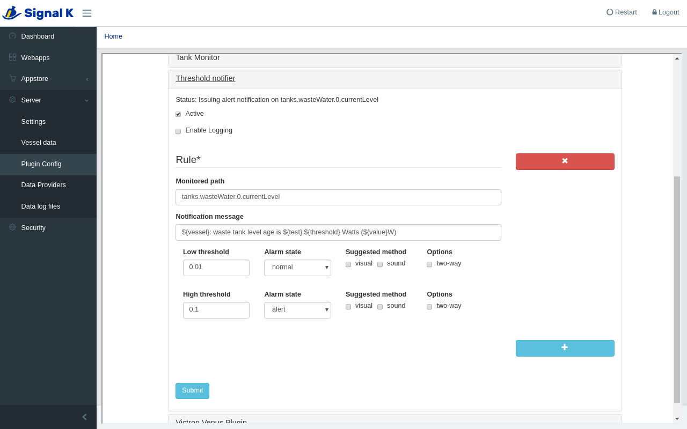

# signalk-threshold-notifier

[Signal K Node Server](https://github.com/SignalK/signalk-server-node) plugin
which raises notifications based on one or more path values.

The real-time values of one or more user-specified paths are compared against
user-defined thresholds and Signal K notifications raised as these boundaries
are encountered. 

Thanks are due to Scott Bender for his
[signalk-simple-notifications](https://github.com/sbender9/signalk-simple-notifications)
plugin which this work simply elaborates.
## System requirements

__signalk-threshold-notifier__ has no special system requirements.
## Installation

Download and install __signalk-threshold-notifier__ using the _Appstore_ link
in your Signal K Node server console.

The plugin can also be downloaded from the
[project homepage](https://github.com/preeve9534/signalk-threshold-notifier)
and installed using
[these instructions](https://github.com/SignalK/signalk-server-node/blob/master/SERVERPLUGINS.md).
## Usage

 __signalk-threshold-notifier__ is configured through the Signal K Node server
plugin configuration interface.
Navigate to _Server_->_Plugin config_ and select the _Threshold notifier_ tab.



Configuration of the plugin is a matter of maintaining the list of rules which
define the plugin's action.

Each rule specifies a Signal K path which should be monitored, the values
which define the thresholds against which notifications should be raised and
the attributes of such notifications.

On first use the list of monitored paths will include a single, empty, entry
which should be completed.
Additional rules can be added by clicking the __[+]__ button and any existing,
unwanted, rules can be deleted by clicking the __[x]__ buttons, both located
in the control panel to the right of the list. 

Each rule includes the following fields.

__Monitored path__  
A required text value which specifies the Signal K Node server path which
should be monitored.
There is no default value.

Enter here the full Signal K path for the value which you would like to
monitor, for example, `tanks.wasteWater.0.currentValue`.

__Notification message__  
An optional text message which will be assigned to the message property of
any issued notification.
The default value is a simple, automatically generated, message.

Enter here the text of the message you would like to be issued when the
monitored path value crosses one of the defined thresholds.
If the option is left blank then the plugin will insert just the monitored
path text as an identifier when it raises a notification.

Any of the following tokens may be used in the supplied message text and will
be interpolated with the described value when the notification message is
composed.

_${path}_ will be replaced by the value of the _Monitored path_ option.

_${test}_ will be replaced by one of "above", "below" or "between" dependant
upon the threshold being crossed and the direction of crossing.

_${threshold}_ will be replaced with the value of the threshold triggering the
rule or, in the case of the path value being between thresholds with the
string "_n_ and _m_" where _n_ is the low threshold and _m_ is the high
threshold.

_${value}_ will be replaced with the instantaneous value of the monitored path
that triggered the rule.

_${vessel}_ will be replaced with Signal K's idea of the vessel name.

An example message text might be "${vessel}: ${path} is ${test} ${threshold} (currently ${value})".

__Low threshold__  
An optional numerical value which sets the lower threshold against which the
monitored path value will be compared.
The default value is a blank entry which disables monitoring of the
low-threshold.

If a value is supplied and the path value falls below this threshold then a
notification of the type specified by the associated options will be issued.
If the 'two-way' option is set, then a notification will again be issued when
the monitored value returns above this threshold.

__Alarm state__  
A required value which will be assigned to the notification _state_ property
which is used to signal the severity of the notification.
Default is to set the alarm state to "alert".

Choose a value appropriate to the notification event.
Remember that notifications in Signal K may be processed by downstream handlers
and the chosen state could have significance elsewhere: an example is the
__signalk-switchbank__ plugin which treats "normal" and non-"normal" alarm
states as binary switch signals.

__Suggested method__  
An optional value which will be assigned to the notification _method_ property
which is used to suggest to downstream notification handlers a preference for
how a displayed alert might be handled.
Default is to express no preference.

Choose a value which you think appropriate, or none at all.

__Options__  

_==> two-way_ causes a notification to be issued when the monitored path value
returns above the specified threshold.
A notification issued in this way always has its _state_ property set to
"normal".

The cluster of options associated with defining a high threshold have similar
semantics to those described above: the __High threshold__ option itself,
naturally, defines an upper threshold against which the monitored path value
will be tested for a low-to-high transition.
## Use cases

__1.  Issuing a notification when a tank level approaches full__

Once upon a time the black water tank on _Beatrice_ overtopped into the bilge.

Gauges and alarms obviously don't do it for me, so I now get the ship to also
send an SMS message to my cell phone when the level of waste in the tank
approaches capacity.
I use the __signalk-renotifier__ plugin to send texts from notifications and
so I need to inject a notification into the tree in order for the whole
process to hang together and the rule I use to do this has the following
settings:
```
Monitored path:         tanks.wasteWater.0.currentLevel
Notification message:   ${vessel}: waste tank level is ${test} ${threshold}
High threshold:         0.8
Alarm state:            alert
Suggested method:       visual
Options:                (none)
```
I now receive the text message "Beatrice: waste tank level is above 0.8" when
the tank level passes the 80% threshold.

__2.  Automatically starting a pump when a tank level approaches full__

Have I mentioned that the black water tank on _Beatrice_ once overflowed.

My environmentally unfriendly last-ditch attempt to stop this ever happening
again (that is when I've not read the gauge, missed the alarm and ignored the
SMS warnings) is to automatically start my discharge pump if the waste tanks
level becomes critical.
I use the __signalk-switchbank__ plugin to start the pump and this requires
an _alert_ notification to start the pump and a subsequent _normal_
notification to stop it. 
The rule I use has the following settings:
```
Monitored path:         tanks.wasteWater.0.currentLevel
Notification message:   ${vessel}: automatic waste tank discharge pump alert: tank level is ${test} ${threshold}
High threshold:         0.9
Alarm state:            alert
Suggested method:       sound
Options:                (none)
Low threshold:          0.01
Alarm state:            normal
Suggested method:       (none)
Options:                (none)
```
My in-for-a-penny, in-for-a-pound approach means that I aim to start the
pump when the tank level passes the 90% threshold and stop the pump when
the level falls below 1%. 

## Messages

__signalk-threshold-notifier__ outputs the following messages to the Signal K
Node server console and system logging facility.

__Monitoring *n* path__[__s__]  
Output when the plugin initialises to report the number, *n*, of Signal K
paths that are being monitored for threshold transition events.

Additionally, the following messages are output just to the system logging
facility.

__{ "state": *state*, "message": *message*, "method": *method*, "timestamp": *date* }__  
Output when a montored value transits a threshold and a notification is about
to be issued.
*state* is set to the notification state (e.g. "alarm", "warning", and so on),
*message* to the text of the notification message, *method* to any requested
notification methods and *date* to the date and time of notification.
## Release history

### 1.0.0

Initial release.

### 2.0.0

A new configuration file schema allows separate notification states and
methods for each threshold transition.
This change allows the plugin to support the notification based switching
strategy implemented by
[signalk-switchbank](https://github.com/preeve9534/signalk-switchbank).

Configuration files areted by __signalk-threshold-notifier__ version 1.0.0
are not compatible with this release, but manual conversion to the new
format is trivial.

